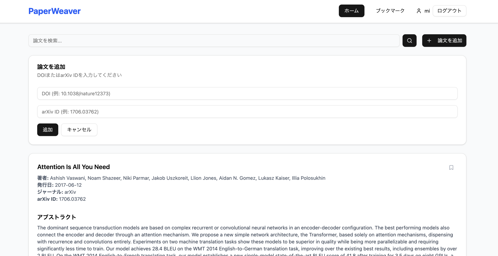

# PaperWeaver

## 概要

PaperWeaverは、学術文献の探索・管理・議論を行うためのMVP（実用最小限製品）です。  
論文の自動登録、検索、ブックマーク、ディスカッションなどの機能を備えています。

---

## 機能一覧

- ユーザー登録・ログイン・プロフィール編集
- DOI/arXiv IDによる論文自動登録・外部API連携
- 論文検索・詳細表示・ブックマーク
- コメント・ディスカッション機能
- プレースホルダーAI要約表示

---

## 技術スタック

- **バックエンド**: Python (Flask, Flask-SQLAlchemy, SQLite)
- **フロントエンド**: React (Vite, shadcn/ui, Tailwind CSS)
- **API連携**: CrossRef, arXiv

---

## セットアップ手順

### 1. リポジトリのクローン

```sh
git clone <このリポジトリのURL>
cd papaerWaver
```

---

### 2. バックエンドのセットアップ

```sh
cd backend
python3 -m venv venv
source venv/bin/activate
pip install -r requirements.txt
```

#### バックエンドの起動

```sh
python app.py
```
または
```sh
export FLASK_APP=app.py
flask run --port=5001
```

---

### 3. フロントエンドのセットアップ

```sh
cd ../frontend
npm install -g pnpm # 初回のみ
pnpm install
```

#### フロントエンドの起動

```sh
pnpm dev
```
ターミナルに表示されるURL（例: http://localhost:5173）にアクセスしてください。

---

## APIエンドポイント例

- `POST /api/register` ユーザー登録
- `POST /api/login` ログイン
- `GET /api/papers` 論文一覧取得
- `POST /api/papers` 論文追加
- `GET /api/users/<user_id>/bookmarks` ブックマーク一覧取得
- ...他、詳細は「実装結果レポート.md」参照

---

## デプロイ・本番運用

- バックエンド: Flask（ポート5001）
- フロントエンド: Vite（ポート5173）
- 本番ではフロントエンドをビルドし、Flaskの静的ファイルとして配信可能

---

## 今後の拡張予定

- AI要約の本格実装
- 引用ネットワーク可視化
- パーソナライズ推薦
- コミュニティ機能強化
- モバイルアプリ対応

---

## 画面イメージ

### ホーム画面（論文検索・一覧表示）

- ホーム画面では、キーワードで論文を検索できます。
- 検索結果として論文のタイトル・著者・要約などが一覧表示されます。
- 各論文をクリックすると詳細ページに遷移できます。
- ブックマークやディスカッションなどの操作も可能です。



---

## ライセンス

（必要に応じて記載） 